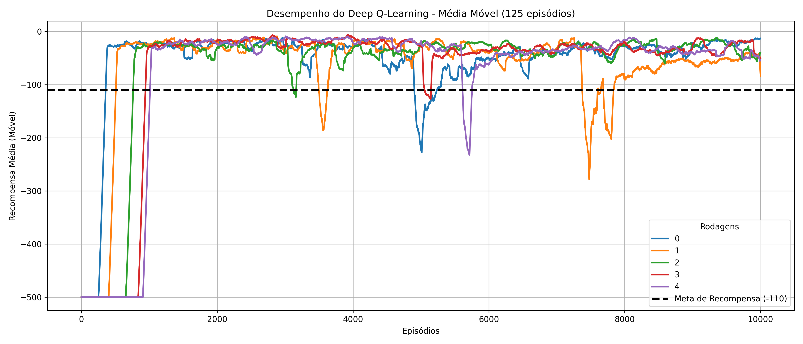
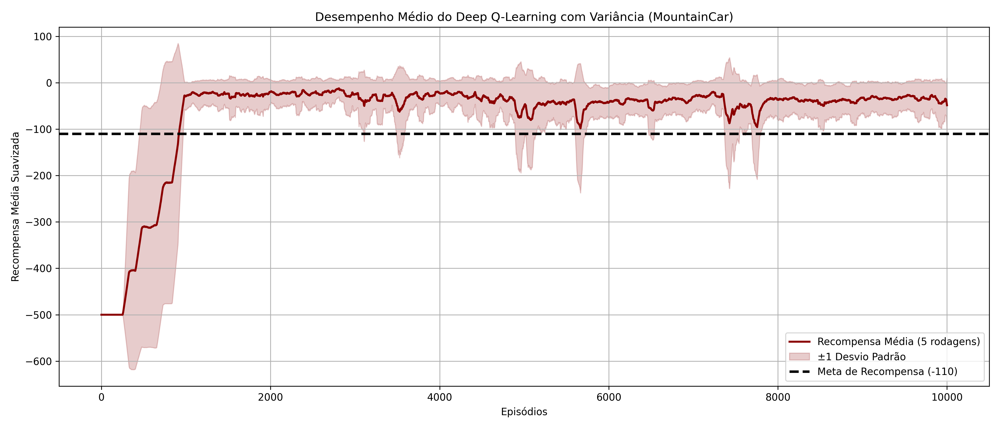

## Implementação Comparativa de Deep-Q-Learning e Q-Learning para o MountainCar-v0

Como visto em aula, a aplicação DeepQLearning nos permite uma aproximação da função Q(s,a) sem precisar explicitamente armazenar cada combinação de estado e ação. Em termos computacionais, visto o exemplo do "Atari" (que imprime cada estado como sendo uma imagem de 210x160), uma solução usando Q-table (Q-Learning ou SARSA) seria inviável. Assim, soluções como o Deep-Q-Learning tornam possível o treinamento do agente, sem esse peso computacional. Veja a seguir uma tabela comparativa dos dois métodos:

| Característica            | Q-Table                         | Rede Neural (DQN)            |
|---------------------------|--------------------------------|------------------------------|
| Espaço de estados         | Pequeno                        | Muito grande                 |
| Generalização             | Baixa                          | Alta                         |
| Eficiência computacional  | Ruim para problemas grandes    | Melhor para problemas complexos |
| Ambientes contínuos       | Ineficiente                    | Funciona bem                 |
| Escalabilidade           | Péssima para estados grandes   | Excelente                     |

