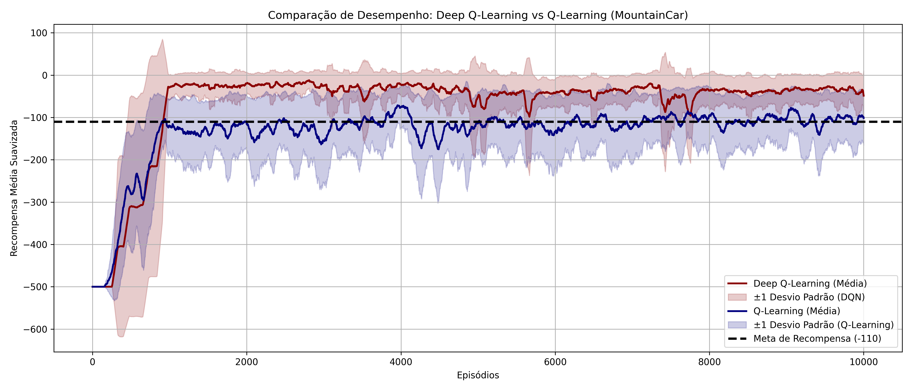

## Implementação Comparativa de Deep-Q-Learning e Q-Learning para o MountainCar-v0

Como visto em aula, a aplicação DeepQLearning nos permite uma aproximação da função Q(s,a) sem precisar explicitamente armazenar cada combinação de estado e ação. Em termos computacionais, visto o exemplo do "Atari" (que imprime cada estado como sendo uma imagem de 210x160), uma solução usando Q-table (Q-Learning ou SARSA) seria inviável. Assim, esta atividade busca executar um experimento com N = 5 rodadas para cada método, analisar os resultados e então identificar os prós e contras de cada método, retratados por uma análise comparativa.

### Desempenho do Deep Q-Learning (DQN)

As imagens a seguir ilustram o desempenho da curva de aprendizado do modelo Deep-Q-Learning:

Torna-se evidente ao observá-las que o método traz consigo uma capacidade boa de abranger grandes espaços de estados, com alta generalização, eficiência computacional e escalabilidade, ou seja, funciona bem em ambientes contínuos e complexos. A comparação entre as várias execuções mostra que a consistência entre as rodadas de treinamento é alta... as curvas das diferentes execuções seguem um padrão semelhante, demonstrando que o modelo não é excessivamente sensível às condições iniciais ou ao ruído estocástico do ambiente.

Os resultados obtidos com o DQL indicam uma trajetória de aprendizado bem definida, com uma curva de recompensa que rapidamente se aproxima da meta estabelecida. A análise da média móvel das recompensas sugere que o modelo é capaz de aprender uma política eficiente em poucas milhares de interações, alcançando rapidamente um nível de desempenho satisfatório. Esse comportamento é coerente com a expectativa de um método baseado em redes neurais, que pode generalizar melhor sobre estados contínuos e aprender padrões mais abstratos a partir da experiência acumulada. Ao longo dos episódios, observa-se uma redução progressiva da variabilidade das recompensas, representada pela faixa de desvio padrão no gráfico: no início do treinamento, há uma grande oscilação na recompensa, indicando a fase de exploração do agente; mas conforme o aprendizado avança e a política se refina, essa variabilidade diminui, e a curva de desempenho se estabiliza próxima da recompensa-alvo. 

Outro aspecto interessante é que, embora a recompensa média estabilize próximo ao valor ideal, o DQL ainda apresenta flutuações ocasionais. Essas quedas pontuais na recompensa podem ser atribuídas a ajustes na rede neural, que ocorrem à medida que novos padrões são assimilados. Isso é uma característica comum de métodos baseados em aprendizado profundo: mesmo após a convergência aparente, pequenas instabilidades podem surgir devido ao refinamento contínuo da política.

### Desempenho do Q-Learning

As imagens a seguir ilustram o desempenho da curva de aprendizado do modelo Q-Learning:

Detalhar resultados do Q-Learning (gráficos e análises)

### Comparação Final: Deep Q-Learning vs Q-Learning

Uma vez analisados individualmente, segue a conclusão comparativa entre os dois métodos. A imagem a seguir plota os resultados em desempenho médio de cada método, assim como a meta de qualidade de modelo:

Detalhar resultados da comparação (gráficos e análises)

### Conclusão

Conclusão objetiva e numérica

| Característica            | Q-Table                         | Rede Neural (DQN)            |
|---------------------------|--------------------------------|------------------------------|
| Espaço de estados         | Pequeno                        | Muito grande                 |
| Generalização             | Baixa                          | Alta                         |
| Eficiência computacional  | Ruim para problemas grandes    | Melhor para problemas complexos |
| Ambientes contínuos       | Ineficiente                    | Funciona bem                 |
| Escalabilidade           | Péssima para estados grandes   | Excelente                     |

