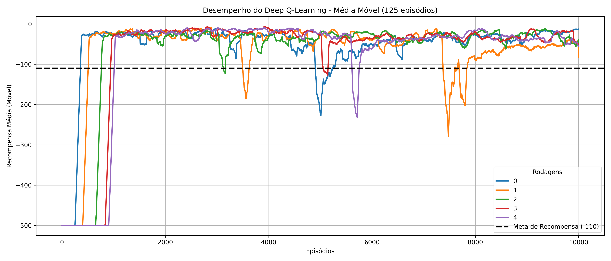
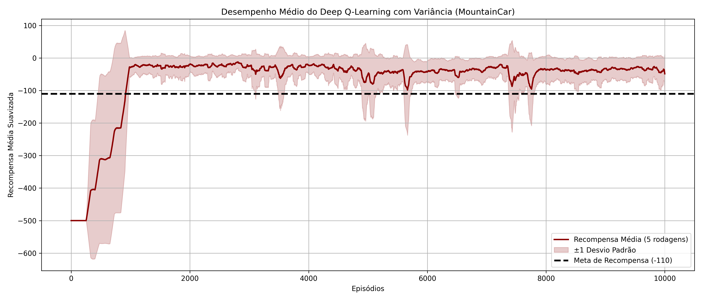
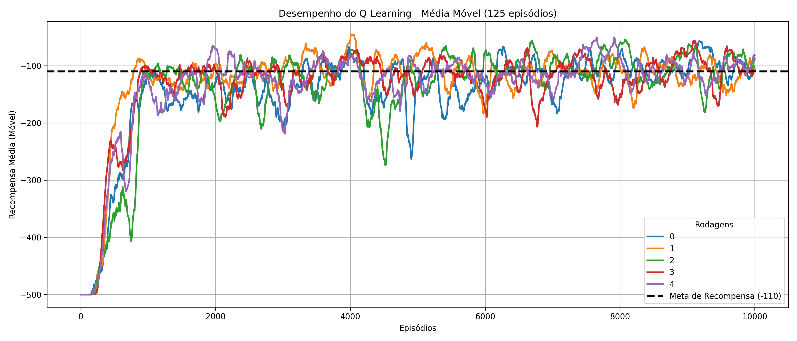
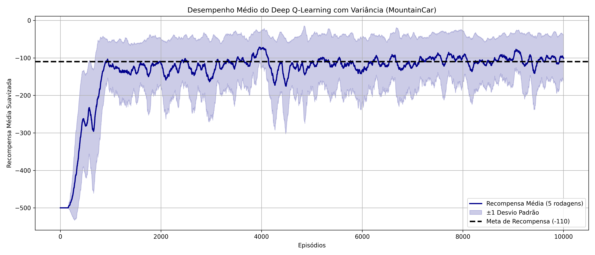
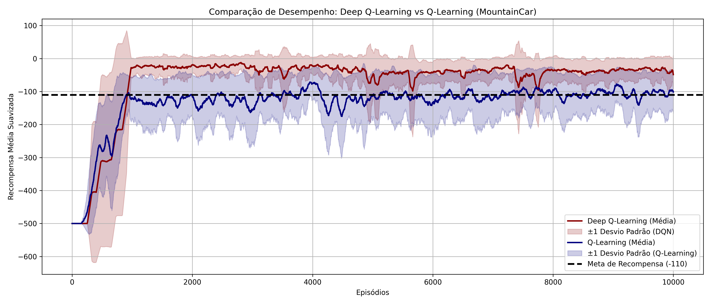

## Implementação Comparativa de Deep-Q-Learning e Q-Learning para o MountainCar-v0

Como visto em aula, a aplicação DeepQLearning nos permite uma aproximação da função Q(s,a) sem precisar explicitamente armazenar cada combinação de estado e ação. Em termos computacionais, visto o exemplo do "Atari" (que imprime cada estado como sendo uma imagem de 210x160), uma solução usando Q-table (Q-Learning ou SARSA) seria inviável. Assim, esta atividade busca executar um experimento com N = 5 rodadas para cada método, analisar os resultados e então identificar os prós e contras de cada método, retratados por uma análise comparativa.

### Desempenho do Deep Q-Learning (DQN)

As imagens a seguir ilustram o desempenho da curva de aprendizado do modelo Deep-Q-Learning:

Torna-se evidente ao observá-las que o método traz consigo uma capacidade boa de abranger grandes espaços de estados, com alta generalização, eficiência computacional e escalabilidade, ou seja, funciona bem em ambientes contínuos e complexos. A comparação entre as várias execuções mostra que a consistência entre as rodadas de treinamento é alta... as curvas das diferentes execuções seguem um padrão semelhante, demonstrando que o modelo não é excessivamente sensível às condições iniciais ou ao ruído estocástico do ambiente.

Os resultados obtidos com o DQL indicam uma trajetória de aprendizado bem definida, com uma curva de recompensa que rapidamente se aproxima da meta estabelecida. A análise da média móvel das recompensas sugere que o modelo é capaz de aprender uma política eficiente em poucas milhares de interações, alcançando rapidamente um nível de desempenho satisfatório. Esse comportamento é coerente com a expectativa de um método baseado em redes neurais, que pode generalizar melhor sobre estados contínuos e aprender padrões mais abstratos a partir da experiência acumulada. Ao longo dos episódios, observa-se uma redução progressiva da variabilidade das recompensas, representada pela faixa de desvio padrão no gráfico: no início do treinamento, há uma grande oscilação na recompensa, indicando a fase de exploração do agente; mas conforme o aprendizado avança e a política se refina, essa variabilidade diminui, e a curva de desempenho se estabiliza próxima da recompensa-alvo. 

Outro aspecto interessante é que, embora a recompensa média estabilize próximo ao valor ideal, o DQL ainda apresenta flutuações ocasionais. Essas quedas pontuais na recompensa podem ser atribuídas a ajustes na rede neural, que ocorrem à medida que novos padrões são assimilados. Isso é uma característica comum de métodos baseados em aprendizado profundo: mesmo após a convergência aparente, pequenas instabilidades podem surgir devido ao refinamento contínuo da política.

### Desempenho do Q-Learning

As imagens a seguir ilustram o desempenho da curva de aprendizado do modelo Q-Learning:

 Os resultados obtidos com o Q-Learning mostram que, apesar das limitações inerentes à discretização do espaço de estados, o agente conseguiu aprender uma política razoavelmente eficiente para resolver o ambiente MountainCar-v0. A análise das curvas de aprendizado revela um padrão de convergência relativamente rápido nas primeiras interações, mas com maior variabilidade nas recompensas ao longo dos episódios, especialmente quando comparado ao Deep Q-Learning. 

 No primeiro gráfico, que exibe a evolução da recompensa média móvel para cada uma das execuções, podemos observar que todas as rodadas seguem um padrão semelhante: no início do treinamento, as recompensas são extremamente baixas, com valores próximos de -500, pois o agente ainda está explorando o ambiente sem um conhecimento sólido da melhor estratégia. No entanto, conforme o aprendizado avança, as recompensas começam a aumentar rapidamente e, por volta do episódio 1000, todas as execuções atingem um patamar próximo à meta de desempenho (-110). 

 No entanto, diferente do Deep Q-Learning, o Q-Learning apresenta uma dispersão maior entre as diferentes execuções, com algumas rodadas conseguindo manter um desempenho mais consistente, enquanto outras oscilam mais. Isso pode ser atribuído ao fato de que a atualização tabular da Q-table depende diretamente da discretização dos estados e das escolhas específicas feitas pelo agente durante a fase inicial de exploração. Pequenas variações na trajetória de aprendizado podem levar a diferenças significativas nos valores armazenados na tabela Q. 

 O segundo gráfico, que representa a recompensa média ao longo das execuções, deixa ainda mais evidente essa oscilação. Embora o agente tenha sido capaz de atingir a meta de recompensa, sua curva de aprendizado apresenta flutuações mais intensas em relação ao Deep Q-Learning. O intervalo de desvio padrão também é consideravelmente maior, refletindo a instabilidade da abordagem baseada em Q-tables. Isso se deve à falta de generalização do método, que exige um número muito maior de interações para cobrir todas as possíveis combinações de estados e ações de forma eficiente. 

 Apesar dessas limitações, é interessante notar que o Q-Learning ainda consegue aprender uma estratégia funcional para o problema, atingindo a meta estabelecida na maioria das execuções. Isso sugere que, para problemas de baixa dimensionalidade e espaços de estados discretizáveis, o método ainda pode ser uma alternativa viável, principalmente quando não há recursos computacionais suficientes para treinar redes neurais profundas. No entanto, conforme discutiremos a seguir na comparação entre os dois métodos, o Deep Q-Learning oferece vantagens significativas em termos de estabilidade, desempenho e generalização. 

### Comparação Final: Deep Q-Learning vs Q-Learning

Uma vez analisados individualmente, segue a conclusão comparativa entre os dois métodos. A imagem a seguir plota os resultados em desempenho médio de cada método, assim como a meta de qualidade de modelo:

 A análise comparativa entre Deep Q-Learning (DQL) e Q-Learning (QL) revela diferenças significativas no desempenho dos algoritmos para a resolução do problema MountainCar-v0. O gráfico acima evidencia essas diferenças ao apresentar a trajetória de aprendizado médio dos dois métodos ao longo dos episódios. 

 A primeira observação importante é a **velocidade de aprendizado**: o DQL atinge rapidamente a meta de recompensa de -110, enquanto o Q-Learning demora mais tempo para estabilizar sua política. Isso ocorre porque o DQL utiliza uma rede neural para aprender e generalizar sobre o espaço contínuo de estados, enquanto o Q-Learning depende de uma tabela Q discreta, que requer mais interações para cobrir uma fração significativa do espaço de estados. 

 Além disso, o **desvio padrão** das recompensas ao longo do treinamento é menor no DQL do que no Q-Learning. No Q-Learning, há uma oscilação constante nos valores aprendidos, refletindo a dificuldade do algoritmo em encontrar uma política ótima estável. Já no DQL, observa-se uma redução progressiva dessa oscilação, indicando que o modelo aprendeu uma política mais consistente e generalizável. 

 Outro ponto crítico é a **estabilidade após a convergência**. O DQL mantém um desempenho médio acima da meta de recompensa durante praticamente todo o treinamento, enquanto o Q-Learning apresenta quedas esporádicas e uma variabilidade maior mesmo após milhares de episódios. Isso reforça a ideia de que o DQL, por contar com uma função de aproximação baseada em rede neural, consegue capturar melhor os padrões do ambiente e tomar decisões mais eficientes. 

 Por fim, sintetizamos as principais diferenças entre os métodos na tabela abaixo: 

| Característica                  | Q-Learning                          | Deep Q-Learning (DQL)            |
|----------------------------------|-------------------------------------|----------------------------------|
| **Velocidade de Convergência**   | Lenta                               | Rápida                           |
| **Generalização**                | Baixa                               | Alta                             |
| **Eficiência Computacional**     | Ruim para estados contínuos         | Melhor para espaços grandes      |
| **Estabilidade da Política**     | Oscilação constante                 | Mais consistente                 |
| **Variabilidade Entre Execuções**| Alta                                | Baixa                            |
| **Desempenho Final**             | Próximo, mas abaixo da meta (-110)  | Atinge e mantém a meta (-110)    |

 Com base nessas evidências, podemos concluir que **o Deep Q-Learning se mostra mais eficiente para resolver o problema MountainCar-v0**. A combinação de aprendizado por reforço com redes neurais permite que o modelo **aprenda políticas melhores, com maior estabilidade e menor variação entre execuções**. O Q-Learning, embora funcional, apresenta limitações claras quando aplicado a ambientes contínuos e de alta dimensionalidade, reforçando a necessidade de aproximação de funções em problemas mais complexos. 

